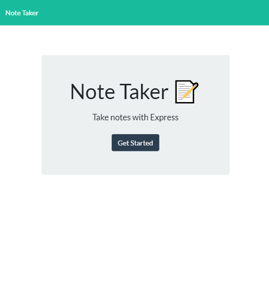
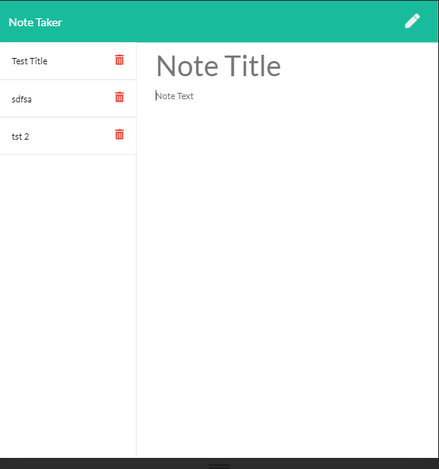

Note Taker is a first trial of setting up the backend of a website using express. 
While the front end was supplied all backend work from routing to hosting on heroku was done by the students.
The ability to get and post to servers is a necessary step in learning fullstack development.

Hosted deployment on Heroku: https://shrouded-citadel-24041.herokuapp.com/

